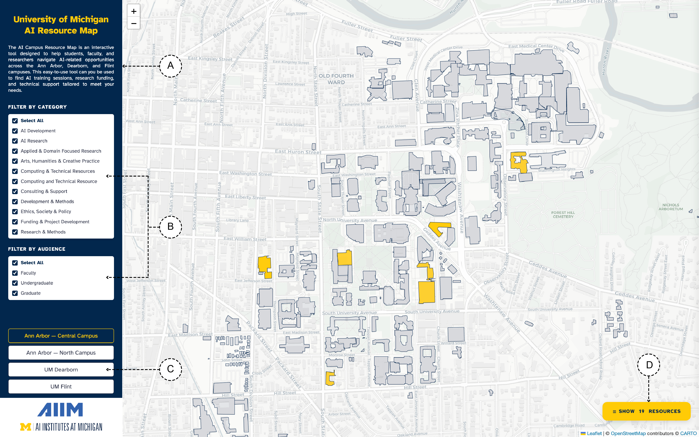
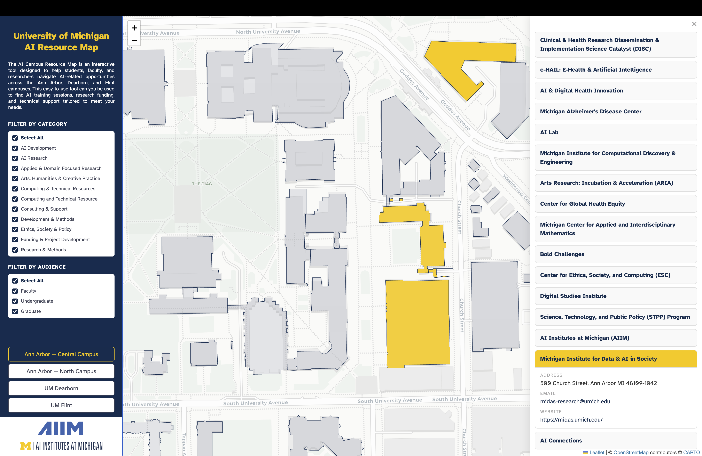

# Introduction
This project maps the locations of AI resources across the three campuses of the University of Michigan — Ann Arbor, Dearborn, and Flint. The goal is to provide an interactive, spatial overview of organizations, labs, and facilities that offer AI-related services and research support across the university. Because these resources are distributed across many departments and buildings, they can be difficult for students, faculty, and researchers to identify and navigate. By visualizing them on a map, the project helps users more easily discover available resources, understand where AI-related activity is distributed across campuses, and identify potential opportunities for collaboration or support.

# Map Features

The interactive map provides several features to help users explore AI resources across the University of Michigan campuses.

**A — Title & Introduction.** A header and brief description in the left sidebar introduce the AI Resource Map and its purpose.

**B — Filter Panels.** Two multi-select filter lists let users narrow down resources:
- *Filter by Category* : filter buildings by service type (e.g., AI Development, AI Research, Consulting & Support, Ethics, Society & Policy, Funding & Project Development).
- *Filter by Audience* : filter by intended user group (Faculty, Undergraduate, Graduate).

Each list includes a "Select All" toggle. Buildings on the map are color-coded in real time: matching AI resource buildings appear in maize (#FFCB05).

**C — Campus Extent Buttons.** Quick navigation buttons fly the map to a selected campus view: Ann Arbor — Central Campus, Ann Arbor — North Campus, UM Dearborn, or UM Flint. The active campus is highlighted.

**D — Show Resources Button.** A floating button in the bottom-right corner displays the count of currently filtered resources and opens the right sidebar listing them.

**Right Sidebar — Resource List & Details.** Clicking the "Show Resources" button or any highlighted building opens the right sidebar. It displays:
- A list of all filtered resources or all resources at the selected building.
- Expandable resource cards revealing a description, address, email, website, applicable categories, and audience tags.
- Clicking a resource in the list flies the map to that building's location at a closer zoom.

**Interactive Building Behavior.** Hovering over any building shows a tooltip with its name. Clicking on an AI resource building zooms in and opens its detail card in the right sidebar. Clicking elsewhere on the map closes the sidebar.

# Framework
The map is built using Leaflet.js, a lightweight open-source JavaScript library for interactive maps. The interface includes a left sidebar for filtering and navigation, and a right sidebar that displays detailed information when a resource building is selected.

# Data
- **Building footprints** — Shapefile provided by the University of Michigan Facilities & Operations Information Services, accessed via ArcGIS Online ([link](https://www.arcgis.com/home/item.html?id=ba25642ae276429b8664dda39ba261e3)). Last updated July 8, 2025.
- **AI resource details** — Custom dataset compiled from University of Michigan departmental websites, research centers, program pages, and surveys. The dataset includes the names of each resource along with information on the specific services and initiatives offered, contact information, street addresses, and consultation hours (if offered). Data was manually collected and standardized to support spatial integration with campus building footprints. This dataset is not an official university dataset and may not be exhaustive.
